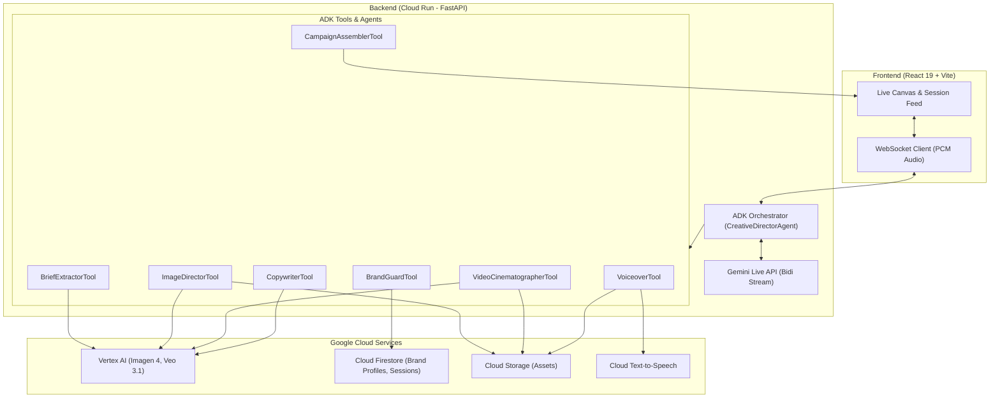

# ✦ Fluence AI — The Live Creative Director ✦

**You speak. It creates. Everything, at once.**

Fluence AI is a live creative director: you describe your brand in a voice conversation and a complete campaign — hero image, video concept, copy, voiceover, and creative brief — emerges inline, simultaneously, as the AI speaks.

Built for the **Gemini Live Agent Challenge 2026** (Creative Storyteller Category).

---

## 🏗️ System Architecture



---

## 🛠️ Tech Stack

- **Intelligence**: Gemini Live API (gemini-live-2.5-flash)
- **Orchestration**: Google Agent Development Kit (ADK)
- **Backend**: Python 3.11 + FastAPI
- **Frontend**: React 19 + TypeScript + Vite + Tailwind CSS
- **Infrastructure**: Google Cloud Run, Cloud Firestore, Cloud Storage, Cloud TTS
- **Generative Media**: Vertex AI Imagen 4 (Images) & Veo 3.1 (Video)

---

## 🚀 Getting Started

### Backend Setup (`/fluence-backend`)

1. **Install Dependencies**:
   ```bash
   cd fluence-backend
   python -m venv venv
   source venv/bin/activate
   pip install -r requirements.txt
   ```

2. **Environment Variables**:
   Create a `.env` or `env.yaml` file with:
   - `GOOGLE_CLOUD_PROJECT`: Your GCP Project ID
   - `GOOGLE_APPLICATION_CREDENTIALS`: Path to your service account key

3. **Run Service**:
   ```bash
   uvicorn main:app --reload --port 8080
   ```

### Frontend Setup (`/fluence-frontend`)

1. **Install Dependencies**:
   ```bash
   cd fluence-frontend
   npm install
   ```

2. **Run Dev Server**:
   ```bash
   npm run dev
   ```

---

## 🏆 Hackathon Submission Proofs

- **Project Category**: Creative Storyteller
- **Multimodal Tech**: Gemini Live API + Vertex AI Interleaved Output
- **ADK Implementation**: Multi-agent orchestration in `fluence-backend/agents/creative_director.py`
- **GCP Deployment**: Backend hosted on Google Cloud Run (see `infrastructure/deploy.sh`)
- **IaC/Automation**: Terraform scripts in `infrastructure/`
